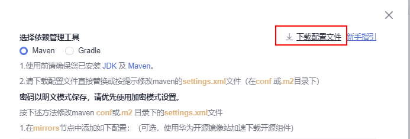
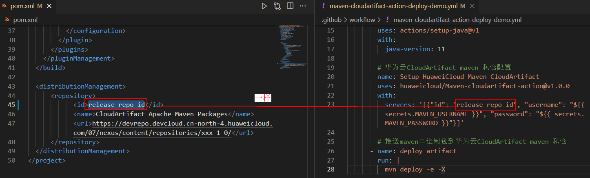
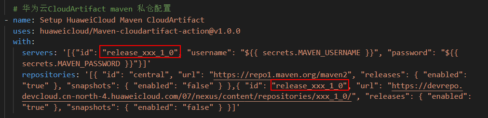

# 使用华为云CloudArtifact Maven 私仓workflows样例
**本READEME指导是基于[Maven CloudArtifact Action](https://github.com/marketplace/actions/huaweicloud-maven-cloudartifact)使用华为云CloudArtifact Maven 私仓workflows样例**   
  
私有依赖库(CloudArtifact)是发布服务（[CloudRelease](https://support.huaweicloud.com/cloudrelease/index.html)）的语言软件仓库功能。用于管理私有组件（开发者通俗称之为私服），包括Maven、Npm、Go、PyPI、Rpm等多种仓库格式。   
使用华为云CloudArtifact Maven 私仓有如下场景：  
1.mvn deploy 推送maven组件到 CloudArtifact Maven 私仓   
2.mvn package 拉取CloudArtifact Maven 私仓的maven组件 

## 前置工作
(1) [新建私有依赖库](https://support.huaweicloud.com/usermanual-releaseman/cloudrelease_01_0008.html)  
(2) [仓库权限](https://support.huaweicloud.com/usermanual-releaseman/cloudrelease_01_0011.html)  
上传maven组件需要权限: 仓库角色为仓库管理员、开发者  
下载maven组件需要权限: 仓库角色为仓库管理员、开发者、浏览者  
> 不是仓库成员或者没有对应权限需要租户帐号、仓库管理员修改为对应的仓库角色。

(3) CloudArtifact Maven 私仓账号信息获取  
[私有依赖库首页](https://devcloud.cn-north-4.huaweicloud.com/cloudartifact/repository)->点击需要的Maven仓库->右上角操作指导->点击下载配置文件->Maven配置在下载的settings.xml文件当中  


## 参数说明
Maven-cloudartifact-action 参数都属于Maven settings.xml文件的元素，详细了解可以到官网[Maven Settings ](http://maven.apache.org/settings.html)。本action四个参数servers, mirrors,repositories,pluginRepositories都是json array的格式。下面给出四个参数的具体的样例。用户可以根据自己实际的仓库信息替换id,url等里面的参数值。  
### `servers`  
```yml
steps:
- uses: huaweicloud/Maven-cloudartifact-action@v1.0.0
  with:
    servers: '[{"id": "serverId", "username": "${{ secrets.MAVEN_USERNAME }}", "password": "${{ secrets.MAVEN_PASSWORD }}"}]'
```
### `mirrors`  
```yml
steps:
- uses: huaweicloud/Maven-cloudartifact-action@v1.0.0
  with:
     mirrors: '[{"id": "mirrorId", "mirrorOf": "mirrorOf", "url": "mirrorUrl"}]'
```
### `repositories`  
```yml
steps:
- uses: huaweicloud/Maven-cloudartifact-action@v1.0.0
  with:
    repositories: '[{ "id": "some-repository", "url": "http://<private_repo_url>", "releases": { "enabled": "true" }, "snapshots": { "enabled": "false" } }]'
```
### `pluginRepositories`  
```yml
steps:
- uses: huaweicloud/Maven-cloudartifact-action@v1.0.0
  with:
    plugin_repositories: '[{ "id": "some-plugin-repository", "url": "http://<private_repo_url>", "releases": { "enabled": "true" }, "snapshots": { "enabled": "false" }}]'
```

## **CloudArtifact Maven 私仓workflows样例**
### 1.mvn deploy: 推送maven组件到 CloudArtifact Maven 私仓 
步骤说明：  
(1)代码检出  
(2)华为云CloudArtifact maven 私仓配置    
(3)maven deploy 推送maven二进制包到华为云CloudArtifact maven 私仓
```yaml
name: Maven Cloudartifact Action Deploy Demo
on:
  push:
    branches:
       master
jobs:
  Publish-to-CloudArtifact:
    runs-on: ubuntu-latest
    steps:
        # 代码检出
      - uses: actions/checkout@v2

        # GitHub Action环境默认java版本为11，可以根据自己项目需求修改java版本
      - name: Set up JDK 11 for maven build
        uses: actions/setup-java@v1
        with:
          java-version: 11

        # 华为云CloudArtifact maven 私仓配置 
      - name: Setup HuaweiCloud Maven CloudArtifact
        uses: huaweicloud/Maven-cloudartifact-action@v1.0.0
        with: 
          servers: '[{"id": "release_repo_id", "username": "${{ secrets.MAVEN_USERNAME }}", "password": "${{ secrets.MAVEN_PASSWORD }}"}]'
    
        # 推送maven二进制包到华为云CloudArtifact maven 私仓
      - name: deploy artifact 
        run: |
          mvn deploy -e -X
```
详情可参考 ./github/workflows/maven-cloudartifact-action-deploy-demo.yml
> 【**注意**】  
> 1.mvn deploy， pom文件里面必须包含有效的`<distributionManagement/>`元素,可以参考当前仓库pom.xml文件   
> Reference: [Maven Deploy](https://maven.apache.org/plugins/maven-deploy-plugin/usage.html)  
> 2.action的参数servers中，id需要与pom文件中`<distributionManagement/>`元素的仓库id一致。可以参考当前仓库pom.xml文件和maven-cloudartifact-action-deploy-demo.yml    
>  

### 2.mvn package: 拉取CloudArtifact Maven 私仓的maven组件 
步骤说明：  
(1)代码检出  
(2)华为云CloudArtifact maven 私仓配置  
(3)maven package 拉取华为云CloudArtifact maven 私仓二进制包构建工程
```yaml
name: Maven Cloudartifact Action Package Demo
on:
  push:
    branches:
       master
jobs:
  Install-CloudArtifact:
    runs-on: ubuntu-latest
    steps:
        # 代码检出
      - uses: actions/checkout@v2

        # GitHub Action环境默认java版本为11，可以根据自己项目需求修改java版本
      - name: Set up JDK 11 for maven build
        uses: actions/setup-java@v1
        with:
          java-version: 11

        # 华为云CloudArtifact maven 私仓配置
      - name: Setup HuaweiCloud Maven CloudArtifact
        uses: huaweicloud/Maven-cloudartifact-action@v1.0.0
        with: 
          servers: '[{"id": "release_repo_id", "username": "${{ secrets.MAVEN_USERNAME }}", "password": "${{ secrets.MAVEN_PASSWORD }}"}]'
          repositories: '[{ "id": "central", "url": "https://repo1.maven.org/maven2", "releases": { "enabled": "true" }, "snapshots": { "enabled": "false" } },{ "id": "release_repo_id", "url": "https://<release_private_repo_url>/", "releases": { "enabled": "true" }, "snapshots": { "enabled": "false" } }]'

        # 拉取华为云CloudArtifact maven 私仓二进制包构建工程
      - name: package artifact
        run: |
          mvn package -e -X
```
详情可参考 ./github/workflows/maven-cloudartifact-action-package-demo.yml
> 【**注意点**】  
> 1.首先确保需要下载的组件在CloudArtifact maven 私仓  
> 2.将需要下载的组件添加进pom文件，如下面的依赖  
> `<dependency>`  
>    `<groupId>com.huawei.devcloud</groupId>`  
>    `<artifactId>demoapp</artifactId>`  
>    `<version>1.0.0</version>`  
> `</dependency>`  
> 3.下载组件的maven坐标(groupId:artifactId:version)与当前工程的坐标不能一样。  
> 4.settings.xml中repositories中需要账号信息的仓库id需与settings.xml中server节点下的仓库id一致。也就是action输入参数servers与repositories的id一致。可以参考当前仓库的文件./github/workflows/maven-cloudartifact-action-package-demo.yml
> 

## 公网域名说明
```
Maven官方中心仓：'https://repo1.maven.org/maven2'
```